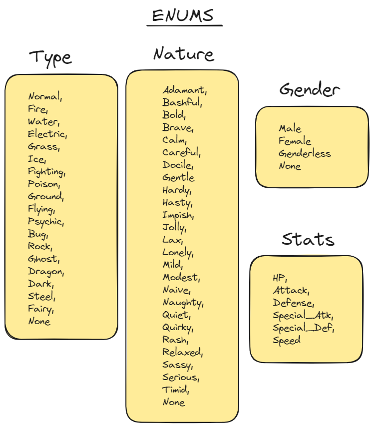
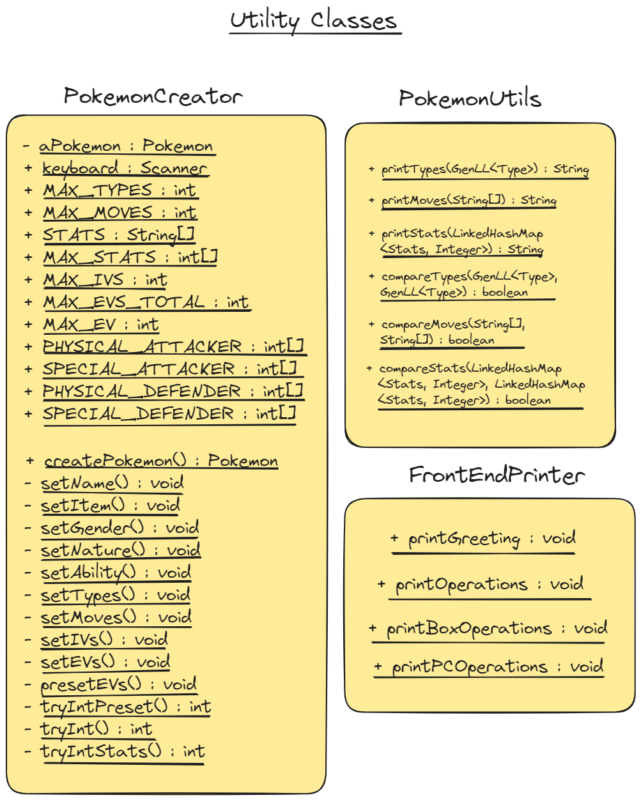
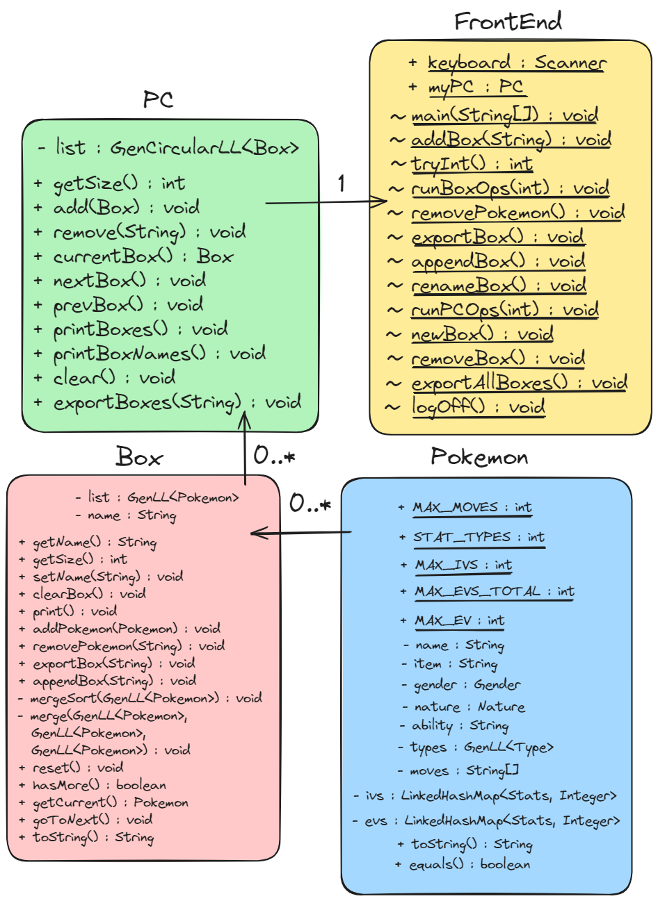
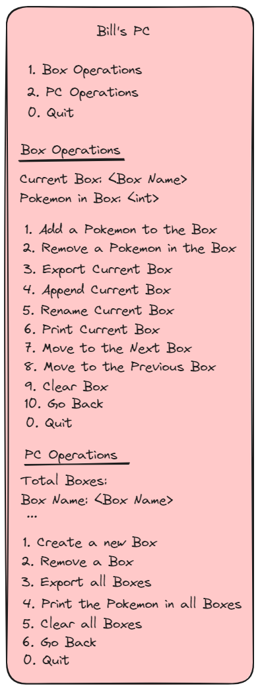

# Bill's PC

## Objective

Create a PC system that acts like the one in Pokemon Games. Allow the user to create a Pokemon, add the Pokemon to a Box, and traverse the PC to view different Boxes.

## Enums

I used enums for Pokemon attributes like gender, nature, stats, and type(s).



## Generic Data Structures

I used a Generic Singly Linked List to allow the user to add as many Pokemon to a Box as they wanted. I also used a Generic Doubly Circular Linked List to allow the user to add as many Boxes to the PC as they wanted.

The Circular Data Structure also allowed for Box movement like the PC system in the Pokemon Game.


## Uitlity Classes

### Pokemon Utils

This class is a helper for the Pokemon class. It contains printing methods for a Pokemon's Type(s), Moves, and Stats. It also contains helper methods for a Pokemon's `equals()` method.

### Pokemon Creator

This class is used in the Front End to create a Pokemon, and set all its properties.

### Front End Printer

This class is used in the Front End to print the different operations the program offers.



## Basic UML



## Front End Example



## Example Dialogue

```
Logged into Bill's PC
A Box has been created for you..

1. Box Operations
2. PC Operations
0. Quit
1
===Current Box===
Box Name: Generic Box
Pokemon in Box: 0

1. Add a Pokemon to the Box
2. Remove a Pokemon in the Box
3. Export Current Box
4. Append Current Box
5. Rename Current Box
6. Print Current Box
7. Move to the Next Box
8. Move to the Previous Box
9. Clear Box
10. Go Back
0. Quit
1
Enter the name of the Pokemon:
Arcanine
Enter the item held by Arcanine:
Assault Vest
Enter the gender of Arcanine:
Male
Enter the nature of Arcanine:
Jolly
Enter the ability of Arcanine:
Intimidate
Enter the amount of types for Arcanine:
1
Enter a type:
Fire
Enter the amount of moves Arcanine has:
4
Enter move 1:
Flare Blitz
Enter move 2:
Wild Charge
Enter move 3:
Close Combat
Enter move 4:
Extremespeed
Next we will set up the IVs of Arcanine.
The max IVs of each stat is 31, anything over will be set to a default value.

Would you like to set max IVs?
Enter "yes" to assign 31 in each Stat.
yes
Arcanine's IVs have been set to 31
Finally we will set up the EVs of Arcanine.
The max EVs a stat can have is 252.
The max total a Pokemon can have is 510.
Anything over will be set to a default value.

Would you like to use a preset EV spread?
Physical Attacker: 252 Attack, 252 Speed, 4 Defense
Special Attacker: 252 Special Attack, 252 Speed, 4 Special Defense
Physical Defender: 252 HP, 252 Defense, 4 Special Defense
Special Defender: 252 HP, 252 Special Defense, 4 Defense
Enter "yes" to use a preset EV spread.
yes
1. Physical Attacker
2. Special Attacker
3. Physical Defender
4. Special Defender
1
Arcanine has been set to a Physical Attacker!

===Current Box===
Box Name: Generic Box
Pokemon in Box: 1

1. Add a Pokemon to the Box
2. Remove a Pokemon in the Box
3. Export Current Box
4. Append Current Box
5. Rename Current Box
6. Print Current Box
7. Move to the Next Box
8. Move to the Previous Box
9. Clear Box
10. Go Back
0. Quit
1
Enter the name of the Pokemon:
Cinderace
Enter the item held by Cinderace:
Heavy-Duty Boots
Enter the gender of Cinderace:
Female
Enter the nature of Cinderace:
Jolly
Enter the ability of Cinderace:
Libero
Enter the amount of types for Cinderace:
1
Enter a type:
Fire
Enter the amount of moves Cinderace has:
4
Enter move 1:
Pyro Ball
Enter move 2:
Hight Jump Kick
Enter move 3:
Sucker Punch
Enter move 4:
U-turn
Next we will set up the IVs of Cinderace.
The max IVs of each stat is 31, anything over will be set to a default value.

Would you like to set max IVs?
Enter "yes" to assign 31 in each Stat.
yes
Cinderace's IVs have been set to 31
Finally we will set up the EVs of Cinderace.
The max EVs a stat can have is 252.
The max total a Pokemon can have is 510.
Anything over will be set to a default value.

Would you like to use a preset EV spread?
Physical Attacker: 252 Attack, 252 Speed, 4 Defense
Special Attacker: 252 Special Attack, 252 Speed, 4 Special Defense
Physical Defender: 252 HP, 252 Defense, 4 Special Defense
Special Defender: 252 HP, 252 Special Defense, 4 Defense
Enter "yes" to use a preset EV spread.
1
Enter the value for HP
0
Enter the value for Attack
252
Enter the value for Defense
4
Enter the value for Special Attack
0
Enter the value for Special Defense
0
Enter the value for Speed
252
===Current Box===
Box Name: Generic Box
Pokemon in Box: 2

1. Add a Pokemon to the Box
2. Remove a Pokemon in the Box
3. Export Current Box
4. Append Current Box
5. Rename Current Box
6. Print Current Box
7. Move to the Next Box
8. Move to the Previous Box
9. Clear Box
10. Go Back
0. Quit
1
Enter the name of the Pokemon:
Fakemon
Enter the item held by Fakemon:
a
Enter the gender of Fakemon:
genderless
Enter the nature of Fakemon:
docile
Enter the ability of Fakemon:
a
Enter the amount of types for Fakemon:
1
Enter a type:
Normal
Enter the amount of moves Fakemon has:
1
Enter move 1:
Struggle
Next we will set up the IVs of Fakemon.
The max IVs of each stat is 31, anything over will be set to a default value.

Would you like to set max IVs?
Enter "yes" to assign 31 in each Stat.
no
Enter the value for HP
2
Enter the value for Attack
2
Enter the value for Defense
2
Enter the value for Special Attack
2
Enter the value for Special Defense
2
Enter the value for Speed
2
Finally we will set up the EVs of Fakemon.
The max EVs a stat can have is 252.
The max total a Pokemon can have is 510.
Anything over will be set to a default value.

Would you like to use a preset EV spread?
Physical Attacker: 252 Attack, 252 Speed, 4 Defense
Special Attacker: 252 Special Attack, 252 Speed, 4 Special Defense
Physical Defender: 252 HP, 252 Defense, 4 Special Defense
Special Defender: 252 HP, 252 Special Defense, 4 Defense
Enter "yes" to use a preset EV spread.
yes
1. Physical Attacker
2. Special Attacker
3. Physical Defender
4. Special Defender
2
Fakemon has been set to a Special Attacker!

===Current Box===
Box Name: Generic Box
Pokemon in Box: 3

1. Add a Pokemon to the Box
2. Remove a Pokemon in the Box
3. Export Current Box
4. Append Current Box
5. Rename Current Box
6. Print Current Box
7. Move to the Next Box
8. Move to the Previous Box
9. Clear Box
10. Go Back
0. Quit
6
Box Name: Generic Box

Name: Arcanine
Item: Assault Vest
Gender: Male
Nature: Jolly
Ability: Intimidate
Type(s): Fire
Moves: Flare Blitz, Wild Charge, Close Combat, Extremespeed
IVs: HP: 31 Attack: 31 Defense: 31 Special_Atk: 31 Special_Def: 31 Speed: 31
EVs: HP: 0 Attack: 252 Defense: 4 Special_Atk: 0 Special_Def: 0 Speed: 252

Name: Cinderace
Item: Heavy-Duty Boots
Gender: Female
Nature: Jolly
Ability: Libero
Type(s): Fire
Moves: Pyro Ball, Hight Jump Kick, Sucker Punch, U-turn
IVs: HP: 31 Attack: 31 Defense: 31 Special_Atk: 31 Special_Def: 31 Speed: 31
EVs: HP: 0 Attack: 252 Defense: 4 Special_Atk: 0 Special_Def: 0 Speed: 252

Name: Fakemon
Item: a
Gender: Genderless
Nature: Docile
Ability: a
Type(s): Normal
Moves: Struggle, None, None, None
IVs: HP: 2 Attack: 2 Defense: 2 Special_Atk: 2 Special_Def: 2 Speed: 2
EVs: HP: 0 Attack: 0 Defense: 0 Special_Atk: 252 Special_Def: 4 Speed: 252

===Current Box===
Box Name: Generic Box
Pokemon in Box: 3

1. Add a Pokemon to the Box
2. Remove a Pokemon in the Box
3. Export Current Box
4. Append Current Box
5. Rename Current Box
6. Print Current Box
7. Move to the Next Box
8. Move to the Previous Box
9. Clear Box
10. Go Back
0. Quit
2
Enter the name of the Pokemon to remove:
Fakemon
Fakemon has been successfully removed

===Current Box===
Box Name: Generic Box
Pokemon in Box: 2

1. Add a Pokemon to the Box
2. Remove a Pokemon in the Box
3. Export Current Box
4. Append Current Box
5. Rename Current Box
6. Print Current Box
7. Move to the Next Box
8. Move to the Previous Box
9. Clear Box
10. Go Back
0. Quit
5
Enter the new name for Generic Box
Faves
===Current Box===
Box Name: Faves
Pokemon in Box: 2

1. Add a Pokemon to the Box
2. Remove a Pokemon in the Box
3. Export Current Box
4. Append Current Box
5. Rename Current Box
6. Print Current Box
7. Move to the Next Box
8. Move to the Previous Box
9. Clear Box
10. Go Back
0. Quit
10
1. Box Operations
2. PC Operations
0. Quit
2

Total Boxes:
Box Name: Faves

1. Create a new Box
2. Remove a Box
3. Export all Boxes
4. Print the Pokemon in all Boxes
5. Clear all Boxes
6. Go Back
0. Quit
1
Enter the name of the new Box:
Dragon

Total Boxes:
Box Name: Faves
Box Name: Dragon

1. Create a new Box
2. Remove a Box
3. Export all Boxes
4. Print the Pokemon in all Boxes
5. Clear all Boxes
6. Go Back
0. Quit
1
Enter the name of the new Box:
Water

Total Boxes:
Box Name: Faves
Box Name: Dragon
Box Name: Water

1. Create a new Box
2. Remove a Box
3. Export all Boxes
4. Print the Pokemon in all Boxes
5. Clear all Boxes
6. Go Back
0. Quit
6
1. Box Operations
2. PC Operations
0. Quit
1
===Current Box===
Box Name: Faves
Pokemon in Box: 2

1. Add a Pokemon to the Box
2. Remove a Pokemon in the Box
3. Export Current Box
4. Append Current Box
5. Rename Current Box
6. Print Current Box
7. Move to the Next Box
8. Move to the Previous Box
9. Clear Box
10. Go Back
0. Quit
7
===Current Box===
Box Name: Dragon
Pokemon in Box: 0

1. Add a Pokemon to the Box
2. Remove a Pokemon in the Box
3. Export Current Box
4. Append Current Box
5. Rename Current Box
6. Print Current Box
7. Move to the Next Box
8. Move to the Previous Box
9. Clear Box
10. Go Back
0. Quit
7
===Current Box===
Box Name: Water
Pokemon in Box: 0

1. Add a Pokemon to the Box
2. Remove a Pokemon in the Box
3. Export Current Box
4. Append Current Box
5. Rename Current Box
6. Print Current Box
7. Move to the Next Box
8. Move to the Previous Box
9. Clear Box
10. Go Back
0. Quit
7
===Current Box===
Box Name: Faves
Pokemon in Box: 2

1. Add a Pokemon to the Box
2. Remove a Pokemon in the Box
3. Export Current Box
4. Append Current Box
5. Rename Current Box
6. Print Current Box
7. Move to the Next Box
8. Move to the Previous Box
9. Clear Box
10. Go Back
0. Quit
8
===Current Box===
Box Name: Water
Pokemon in Box: 0

1. Add a Pokemon to the Box
2. Remove a Pokemon in the Box
3. Export Current Box
4. Append Current Box
5. Rename Current Box
6. Print Current Box
7. Move to the Next Box
8. Move to the Previous Box
9. Clear Box
10. Go Back
0. Quit
7
===Current Box===
Box Name: Faves
Pokemon in Box: 2

1. Add a Pokemon to the Box
2. Remove a Pokemon in the Box
3. Export Current Box
4. Append Current Box
5. Rename Current Box
6. Print Current Box
7. Move to the Next Box
8. Move to the Previous Box
9. Clear Box
10. Go Back
0. Quit
3
Enter the name of the file you would like to create/overwrite (include the file extension):
NewFaves.txt
Faves has been successfully EXPORTED to NewFaves.txt!!!
===Current Box===
Box Name: Faves
Pokemon in Box: 2

1. Add a Pokemon to the Box
2. Remove a Pokemon in the Box
3. Export Current Box
4. Append Current Box
5. Rename Current Box
6. Print Current Box
7. Move to the Next Box
8. Move to the Previous Box
9. Clear Box
10. Go Back
0. Quit
4
Enter the name of the file you would like to append to (include the file extension):
NewFaves.txt
Faves has been successfully APPENDED to NewFaves.txt

===Current Box===
Box Name: Faves
Pokemon in Box: 2

1. Add a Pokemon to the Box
2. Remove a Pokemon in the Box
3. Export Current Box
4. Append Current Box
5. Rename Current Box
6. Print Current Box
7. Move to the Next Box
8. Move to the Previous Box
9. Clear Box
10. Go Back
0. Quit
9
===Current Box===
Box Name: Faves
Pokemon in Box: 0

1. Add a Pokemon to the Box
2. Remove a Pokemon in the Box
3. Export Current Box
4. Append Current Box
5. Rename Current Box
6. Print Current Box
7. Move to the Next Box
8. Move to the Previous Box
9. Clear Box
10. Go Back
0. Quit
6
Faves is currently empty...
===Current Box===
Box Name: Faves
Pokemon in Box: 0

1. Add a Pokemon to the Box
2. Remove a Pokemon in the Box
3. Export Current Box
4. Append Current Box
5. Rename Current Box
6. Print Current Box
7. Move to the Next Box
8. Move to the Previous Box
9. Clear Box
10. Go Back
0. Quit
0
You have successfully logged out of Bill's PC.
```

### NewFaves.txt

```
Name: Arcanine
Item: Assault Vest
Gender: Male
Nature: Jolly
Ability: Intimidate
Type(s): Fire
Moves: Flare Blitz, Wild Charge, Close Combat, Extremespeed
IVs: HP: 31 Attack: 31 Defense: 31 Special_Atk: 31 Special_Def: 31 Speed: 31
EVs: HP: 0 Attack: 252 Defense: 4 Special_Atk: 0 Special_Def: 0 Speed: 252

Name: Cinderace
Item: Heavy-Duty Boots
Gender: Female
Nature: Jolly
Ability: Libero
Type(s): Fire
Moves: Pyro Ball, Hight Jump Kick, Sucker Punch, U-turn
IVs: HP: 31 Attack: 31 Defense: 31 Special_Atk: 31 Special_Def: 31 Speed: 31
EVs: HP: 0 Attack: 252 Defense: 4 Special_Atk: 0 Special_Def: 0 Speed: 252

Name: Arcanine
Item: Assault Vest
Gender: Male
Nature: Jolly
Ability: Intimidate
Type(s): Fire
Moves: Flare Blitz, Wild Charge, Close Combat, Extremespeed
IVs: HP: 31 Attack: 31 Defense: 31 Special_Atk: 31 Special_Def: 31 Speed: 31
EVs: HP: 0 Attack: 252 Defense: 4 Special_Atk: 0 Special_Def: 0 Speed: 252

Name: Cinderace
Item: Heavy-Duty Boots
Gender: Female
Nature: Jolly
Ability: Libero
Type(s): Fire
Moves: Pyro Ball, Hight Jump Kick, Sucker Punch, U-turn
IVs: HP: 31 Attack: 31 Defense: 31 Special_Atk: 31 Special_Def: 31 Speed: 31
EVs: HP: 0 Attack: 252 Defense: 4 Special_Atk: 0 Special_Def: 0 Speed: 252

```

## Example Dialogue 2

```
Logged into Bill's PC
A Box has been created for you..

1. Box Operations
2. PC Operations
0. Quit
2

Total Boxes:
Box Name: Generic Box

1. Create a new Box
2. Remove a Box
3. Export all Boxes
4. Print the Pokemon in all Boxes
5. Clear all Boxes
6. Go Back
0. Quit
1
Enter the name of the new Box:
Fire

Total Boxes:
Box Name: Generic Box
Box Name: Fire

1. Create a new Box
2. Remove a Box
3. Export all Boxes
4. Print the Pokemon in all Boxes
5. Clear all Boxes
6. Go Back
0. Quit
1
Enter the name of the new Box:
Water

Total Boxes:
Box Name: Generic Box
Box Name: Fire
Box Name: Water

1. Create a new Box
2. Remove a Box
3. Export all Boxes
4. Print the Pokemon in all Boxes
5. Clear all Boxes
6. Go Back
0. Quit
1
Enter the name of the new Box:
Dragon

Total Boxes:
Box Name: Generic Box
Box Name: Fire
Box Name: Water
Box Name: Dragon

1. Create a new Box
2. Remove a Box
3. Export all Boxes
4. Print the Pokemon in all Boxes
5. Clear all Boxes
6. Go Back
0. Quit
2
Enter the name of the Box you would like to remove:
generic box
generic box has been successfully removed from the PC!!!

Total Boxes:
Box Name: Fire
Box Name: Water
Box Name: Dragon

1. Create a new Box
2. Remove a Box
3. Export all Boxes
4. Print the Pokemon in all Boxes
5. Clear all Boxes
6. Go Back
0. Quit
3
Enter the name of the file you would like to create/overwrite (include the file extension)
FaveBoxes.txt
All Boxes have been successfully EXPORTED to FaveBoxes.txt!!!

Total Boxes:
Box Name: Fire
Box Name: Water
Box Name: Dragon

1. Create a new Box
2. Remove a Box
3. Export all Boxes
4. Print the Pokemon in all Boxes
5. Clear all Boxes
6. Go Back
0. Quit
4
Fire is currently empty...
Water is currently empty...
Dragon is currently empty...


Total Boxes:
Box Name: Fire
Box Name: Water
Box Name: Dragon

1. Create a new Box
2. Remove a Box
3. Export all Boxes
4. Print the Pokemon in all Boxes
5. Clear all Boxes
6. Go Back
0. Quit
5

Total Boxes:
The PC is currently empty...

1. Create a new Box
2. Remove a Box
3. Export all Boxes
4. Print the Pokemon in all Boxes
5. Clear all Boxes
6. Go Back
0. Quit
6
1. Box Operations
2. PC Operations
0. Quit
0
You have successfully logged out of Bill's PC.

```

### FaveBoxes.txt

```
Box Name: Fire

Box Name: Water

Box Name: Dragon
```
