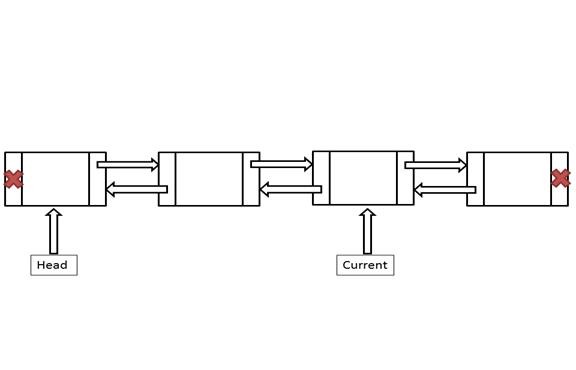
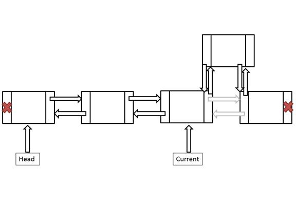

# Double Double Linked List

## Objective

Write a doubly linked list of type double. This link list is similar to the singly linked list except that each node in addition to having data and a next link it now has a previous link.



## Requirements

### Setup the Project

- Use the provided driver file in your project (DoubleLinkedListTester.java)

- Do **NOT** modify the driver

### Create a Doubly Linked List Node

- An internal class must be used to represent a Node in the linked list.

- This node must contain both data and two links.

- One link must point forward to the next item in the list.

- The other link must point backwards to the previous item in the list.

### Create methods gotoNext, gotoPrev, reset, gotoEnd, and hasMore

- The method **“gotoNext”** must move the current reference forward by one node. If the current reference is null, then the method does nothing.

- The method **“gotoPrev”** must move the current reference backwards by one node. If the current reference is null, then the method does nothing.

- The method **“reset”**, must move the current reference to the head reference.

- The method **“gotoEnd”**, must move the current reference to the last node in the list.

- The method **“hasMore”**, must return true if the current reference is not null or false if it is.

- All methods must have the public scope and their identifiers must match exactly what is defined above.

### Create methods getCurrent and setCurrent

- The method **“getCurrent”** must return the data at the current reference. If the current reference is null, then it must return null.

- The method **“setCurrent”** must modify the data at the current reference given new data. If the current reference is null, then it must do nothing.

- All methods must have the public scope and their identifiers must match exactly what is defined above.

### Create methods add and addAfterCurrent

- The method **“add”**, must create a new node with data provided via a parameter and add it to the end of the list. If the head reference is null, then it adds the new node to the start of the list.

- The method **“addAfterCurrent”**, must create a new node with the data provided via a parameter and add it after the current reference. If the current reference is null, then do not add the data to the list. See images below for the concept.

- All methods must have the public scope and their identifiers must match exactly what is defined above.

- After either **“add”** or **“addAfterCurrent”** the integrity of the list must be maintained, and all links and references need to be properly set.

### Create methods remove and removeCurrent

- The method **“remove”**, must search for data provided via a parameter, and remove the node if it is found.

- The method **“removeCurrent”**, must remove the node that is at the current reference. If the current reference is null, then this method does nothing. See images below for the concept.

- All methods must have the public scope and their identifiers must match exactly what is defined above.

- After either **“remove”** or **“removeCurrent”** the integrity of the list must be maintained, and all links and references need to be properly set.

### Create the method print

- This method must print all the data in the linked list to the console.

- The method must have the public scope and their identifiers must match exactly what is defined above.

### Create the method contains

- This method returns true only if data provided via a parameter is contained in the list, and otherwise it returns false.

- The method must have the public scope and their identifiers must match exactly what is defined above.

## Additional Notes

### Add Node After Current Visual Concept



### Remove Current Node Visual Concept


## Example Dialogue

```
------------------------------------------------------

Double Double Linked List Tester

------------------------------------------------------

------------------------------------------------------

Inserting and Contains Test

------------------------------------------------------

SUCCESS: true

------------------------------------------------------

Removing Test

Removing first item, third item, and last item

------------------------------------------------------

SUCCESS: true

------------------------------------------------------

Modified Values Test

Changing all even values to negative values

------------------------------------------------------

SUCCESS: true

------------------------------------------------------

Printing the list

------------------------------------------------------

1.0
3.0
-4.0
5.0
-6.0
7.0
-8.0
Print last element: -8.0
```
