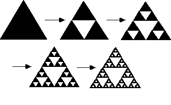
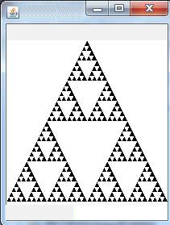

# Sierpinski's Triangle

## Objective

Write a program in which it draws a triangular fractal called Sierpenski’s Triangle using recursion and Java Swing.

## Requirements

### Recursive Method

- A recursive method must be the primary way each triangle is drawn.

- It must determine the positions of each of the 3 points to be drawn.

- This recursive method must not be infinite and must stop when it reaches a pixel limit of 4.

### Draw the Image

- The fractal must be drawn using a Graphical User Interface (GUI).

- See examples below.

## Suggested Methodology

1. First draw a filled triangle

2. Next draw another filled triangle of a different color that’s upside down in the middle of that triangle

3. Using the other triangles formed repeat step 2 until a pixel limit of 4 is reached

## Additional Notes

- JFrame and Canvas are two types that may help.

- The method fillPolygon(int[] xPoints, int[] yPoint, numberOfPoints) as called by the graphics device is important

- The method setColor(Color aColor) is important for picking different colors to draw things.

## Example Image

